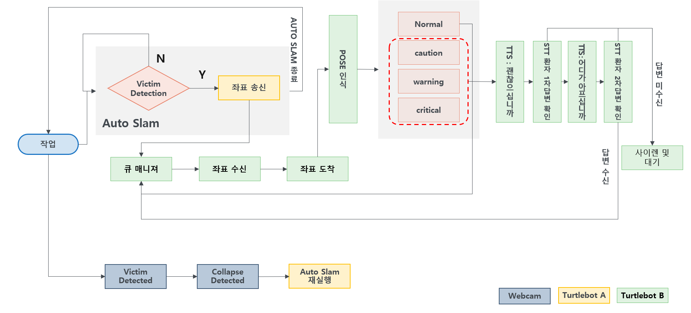

# 다중 로봇 기반 재난 구조 탐색·관제 시스템

[](https://youtu.be/MMzPYvMR2ZU)
↑ 이미지 클릭 시 데모 영상을 확인할 수 있습니다.

재난 상황 시나리오를 가정한 다중 로봇 기반 구조 시스템입니다.

이 프로젝트는 다중 카메라 감지 결과, Robot5(탐색 로봇)의 피해자 검출 이벤트, Robot6(구조 로봇)의 구조 미션 제어를 ROS 2 기반으로 연결합니다. Robot5가 탐색 중 피해자를 검출하면 Robot6가 해당 위치로 이동하고, 도착 후 비전 분석, 음성 안내, 웹 관제 흐름을 수행합니다.

---

## 1. 프로젝트 개요

- 분야: 재난 구조 로봇 / 실내 탐색 / 피해자 감지 / 구조 관제
- 주요 기술: ROS 2 Humble, Python, OpenCV, YOLO, Flask, STT/TTS, Nav2
- 기준 환경: Ubuntu 22.04, ROS 2 Humble, Python 3.10
- 주요 구성:
  - 다중 카메라 감지 노드
  - 탐색 로봇 사람 검출 이벤트 노드
  - 구조 로봇 미션 제어 노드
  - Nav2 기반 이동 제어 노드
  - 피해자 상태 분석 및 음성 상호작용 노드
  - Flask 기반 웹 관제 UI

---

## 2. 프로젝트 목표

- 카메라 영상에서 사람, 로봇, 붕괴 상황을 감지합니다.
- Robot5가 실내 탐색 중 피해자 검출 이벤트를 생성합니다.
- Robot6가 검출 위치 정보를 기반으로 구조 위치까지 이동합니다.
- 도착 후 피해자 상태 분석과 음성 기반 구조 절차를 수행합니다.
- 웹 UI를 통해 카메라 스트림, 로봇 상태, 구조 이벤트를 모니터링합니다.

---

## 3. 저장소 구조

```text
rescue-robot/
├── README.md
├── LICENSE
├── requirements.txt
├── .gitignore
├── docs/
│   ├── Flow_chart.png
│   ├── rescue-robot.png
│   └── system.drawio
└── src/
    ├── camera_system/
    │   ├── camera_system/
    │   ├── launch/
    │   ├── models/
    │   ├── resource/
    │   ├── package.xml
    │   ├── setup.py
    │   └── setup.cfg
    ├── robot5_person_search/
    │   ├── robot5_person_search/
    │   ├── launch/
    │   ├── resource/
    │   ├── package.xml
    │   ├── setup.py
    │   ├── setup.cfg
    │   └── yolo11n.pt
    └── rescue_bot/
        ├── rescue_bot/
        │   ├── analyzer/
        │   ├── models/
        │   └── web/
        ├── docs/
        ├── launch/
        ├── resource/
        ├── package.xml
        ├── setup.py
        └── setup.cfg
```

### 폴더 설명

| 경로 | 설명 |
|---|---|
| `src/camera_system/` | 다중 카메라 영상 발행, 객체 감지, 붕괴 감지 패키지 |
| `src/robot5_person_search/` | Robot5 탐색 및 피해자 검출 이벤트 패키지 |
| `src/rescue_bot/` | Robot6 구조 미션 제어, 비전 분석, 음성 처리, 웹 UI 패키지 |
| `src/rescue_bot/docs/` | Robot6 런타임 계약 문서 |
| `docs/` | README 이미지, 시스템 다이어그램 이미지, drawio 원본 파일 |

---

## 4. 외부 의존성

이 저장소에는 ROS 2, Nav2, TurtleBot4, rosbridge, web_video_server 같은 시스템 패키지를 포함하지 않습니다.

아래 항목은 외부 환경에 별도로 설치해야 합니다.

```text
ROS 2 Humble
Nav2
TurtleBot4 packages
rosbridge_server
web_video_server
cv_bridge
tf2_ros
tf2_geometry_msgs
nav2_simple_commander
explore_lite_msgs
irobot_create_msgs
PortAudio / ALSA audio libraries
```

---

## 5. 주요 패키지

### 5-1. `camera_system`

다중 USB 카메라 영상을 발행하고, YOLO 기반 객체 감지 및 붕괴 감지를 수행하는 패키지입니다.

| 실행 이름 | 역할 |
|---|---|
| `camera_publisher` | USB 카메라 영상 토픽 발행 |
| `detection_node` | YOLO 기반 사람/로봇 감지 |
| `overlay_node` | 감지 결과와 붕괴 정보를 영상에 오버레이 |
| `collapse_detector` | 객체 감지 결과와 영상 차이를 기반으로 붕괴 이벤트 생성 |

주요 출력:

```text
/camera/{camera}/raw
/detection/{camera}/person
/detection/{camera}/turtlebot
/detection/summary/person
/detection/summary/turtlebot
/alert/{camera}/collapse
/alert/{camera}/diff
/output/{camera}/compressed
```

### 5-2. `robot5_person_search`

Robot5가 탐색 중 사람을 검출하면 구조 로봇에서 사용할 피해자 이벤트를 발행하는 패키지입니다.

| 실행 이름 | 역할 |
|---|---|
| `person_event_detector` | OAK-D 영상 기반 피해자 검출 이벤트 생성 |
| `explore_detect_supervisor` | 탐색 상태 관리, 복귀 및 도킹 흐름 제어 |

주요 역할:

- 탐색 중 사람 감지
- 피해자 위치 및 검출 이벤트 생성
- Robot6 구조 미션과 연동되는 이벤트 발행

### 5-3. `rescue_bot`

Robot6 구조 로봇의 미션 흐름을 제어하는 패키지입니다.

| 실행 이름 | 역할 |
|---|---|
| `rescue_control_node` | 도착 이후 구조 세션, 비전 분석, TTS 요청 제어 |
| `rescue_nav_node` | Robot5 검출 이벤트 기반 Nav2 이동 제어 |
| `rescue_stt_node` | 구조 안내 음성 출력 및 음성 응답 처리 |
| `rescue_ui` | Flask 기반 웹 관제 UI |

주요 역할:

- Robot5 검출 이벤트 기반 목표 이동
- 구조 위치 도착 이벤트 발행
- 피해자 자세 및 상태 분석
- TTS/STT 기반 구조 대화
- 웹 UI 기반 구조 상황 관제

---

## 6. 시스템 FLOW



1. 카메라 시스템이 현장 영상을 수신합니다.
2. 객체 감지 시스템이 사람과 붕괴 상황을 감지합니다.
3. Robot5가 탐색 중 피해자를 검출합니다.
4. 피해자 검출 이벤트가 구조 로봇으로 전달됩니다.
5. Robot6가 피해자 위치 기반으로 구조 위치까지 이동합니다.
6. 도착 후 피해자 상태 분석과 음성 안내를 수행합니다.
7. 웹 UI를 통해 구조 상황과 로봇 상태를 모니터링합니다.

---

## 7. Technical Highlights

### 7-1. Multi-Robot Event Pipeline

Robot5 탐색 로봇과 Robot6 구조 로봇을 이벤트 기반으로 연결했습니다.

```text
Robot5 Detection
→ Victim Event
→ Robot6 Dispatch
→ Arrival Event
→ Rescue Interaction
```

탐색과 구조 로직을 분리하여 각 로봇의 역할을 명확히 나누고, 후속 구조 미션을 이벤트 기반으로 확장할 수 있도록 구성했습니다.

### 7-2. Vision / Navigation / Interaction 분리

영상 감지, 이동 제어, 구조 상호작용을 서로 다른 노드 계층으로 분리했습니다.

```text
Vision Layer
→ Navigation Layer
→ Rescue Interaction Layer
```

이 구조는 감지 모델, 이동 정책, 음성 상호작용 로직을 독립적으로 수정할 수 있다는 장점이 있습니다.

### 7-3. Event Monitoring System

`camera_system`은 카메라별 객체 감지와 붕괴 감지 이벤트를 생성합니다.

```text
camera image
→ YOLO detection
→ person / turtlebot event
→ collapse detection
→ alert topic
```

웹 UI와 구조 로봇은 이 이벤트를 기반으로 구조 상황을 모니터링할 수 있습니다.

### 7-4. Web 기반 구조 관제

Flask 기반 웹 UI에서 구조 진행 상태를 확인할 수 있습니다.

- 카메라 스트림
- Robot5 지도 및 상태 정보
- Robot6 위치 및 경로 정보
- 피해자 분석 결과
- 구조 이벤트 및 TTS 기록

---

## 8. 주요 토픽

### Camera / Detection

| 토픽 | 타입 | 설명 |
|---|---|---|
| `/camera/{camera}/raw` | `sensor_msgs/CompressedImage` | 카메라 원본 압축 이미지 |
| `/detection/{camera}/person` | `std_msgs/String` | 카메라별 사람 감지 결과 |
| `/detection/{camera}/turtlebot` | `std_msgs/String` | 카메라별 로봇 감지 결과 |
| `/detection/summary/person` | `std_msgs/Int32` | 전체 카메라 기준 사람 감지 요약 |
| `/detection/summary/turtlebot` | `std_msgs/Int32` | 전체 카메라 기준 로봇 감지 요약 |
| `/alert/{camera}/collapse` | `std_msgs/Bool` | 카메라별 붕괴 감지 이벤트 |
| `/alert/{camera}/diff` | `sensor_msgs/CompressedImage` | 붕괴 감지 차분 이미지 |
| `/output/{camera}/compressed` | `sensor_msgs/CompressedImage` | 웹 UI 표시용 압축 이미지 |

### Robot5 / Search

| 토픽 | 타입 | 설명 |
|---|---|---|
| `/robot5/robot_pose_at_detection` | `geometry_msgs/PoseStamped` | 피해자 검출 시점의 Robot5 위치 |
| `/robot5/victim_point` | `geometry_msgs/PointStamped` | 피해자 추정 위치 |
| `/robot5/victim_event_json` | `std_msgs/String` | 피해자 검출 이벤트 정보 |
| `/robot5/detector_yolo` | `sensor_msgs/Image` | 피해자 검출 시각화 이미지 |
| `/robot5/scan_active` | `std_msgs/Bool` | 탐색 감지 활성화 상태 |
| `/robot/stop` | `std_msgs/Bool` | 복귀 및 도킹 트리거 |

### Robot6 / Rescue

| 토픽 | 타입 | 설명 |
|---|---|---|
| `/robot6/mission/arrived` | `std_msgs/Bool` | 구조 위치 도착 이벤트 |
| `/robot6/mission/timeout` | `std_msgs/Bool` | 구조 이동 타임아웃 |
| `/robot6/mission/abort` | `std_msgs/Bool` | 구조 미션 중단 |
| `/robot6/tts/request` | `std_msgs/String` | 음성 안내 요청 |
| `/robot6/tts/done` | `std_msgs/Bool` | 음성 출력 완료 |
| `/robot6/victim_voice_reply` | `std_msgs/String` | 피해자 음성 응답 결과 |
| `/robot6/session/status` | `std_msgs/String` | 구조 세션 상태 |
| `/robot6/session/result` | `std_msgs/String` | 구조 세션 결과 |
| `/robot6/image_result` | `sensor_msgs/Image` | 피해자 비전 분석 이미지 |
| `/robot6/image_result/compressed` | `sensor_msgs/CompressedImage` | 피해자 비전 분석 압축 이미지 |

---

## 9. 설치 및 빌드

### 9-1. ROS 2 환경 로드

```bash
source /opt/ros/humble/setup.bash
```

### 9-2. 워크스페이스 생성

```bash
mkdir -p ~/ros2_ws/src
cd ~/ros2_ws/src
```

### 9-3. 이 프로젝트 클론

```bash
git clone https://github.com/junss1/rescue-robot.git
```

### 9-4. Python 의존성 설치

```bash
cd ~/ros2_ws/src/rescue-robot
python3 -m pip install -r requirements.txt
```

### 9-5. ROS 의존성 설치

```bash
cd ~/ros2_ws
rosdep install -r --from-paths src/rescue-robot/src --ignore-src --rosdistro humble -y
```

### 9-6. 빌드

```bash
cd ~/ros2_ws
colcon build --symlink-install --base-paths src/rescue-robot/src

source install/setup.bash
```

---

## 10. 실행 방법

### 10-1. camera_system 실행

```bash
ros2 launch camera_system camera_system.launch.py
```

### 10-2. robot5_person_search 실행

```bash
ros2 launch robot5_person_search robot5_person_search.launch.py
```

### 10-3. rescue_bot 실로봇 런타임 실행

```bash
ros2 launch rescue_bot rescue_real.launch.py
```

### 10-4. rescue_bot 웹 UI 실행

```bash
ros2 launch rescue_bot rescue_web.launch.py
```

통합 실행 런치 파일:

```bash
ros2 launch rescue_bot rescue_system.launch.py
```

---

## 11. 모델 파일

이 저장소에는 실행에 필요한 YOLO 모델 파일이 포함되어 있습니다.

```text
src/camera_system/models/best26.pt
src/camera_system/models/yolov8n-seg.pt
src/robot5_person_search/yolo11n.pt
src/rescue_bot/rescue_bot/models/yolo11n-pose.pt
```

---

## 12. Hardware Configuration

실제 사용 환경에 따라 달라질 수 있으나, 코드 기준 주요 전제는 다음과 같습니다.

| 항목 | 내용 |
|---|---|
| OS | Ubuntu 22.04 |
| ROS | ROS 2 Humble |
| Robot Platform | TurtleBot4 기반 |
| Navigation | Nav2 |
| Camera Input | USB Camera / OAK-D |
| Vision | YOLO |
| Web UI | Flask |
| Audio | STT / TTS |
| Communication | ROS 2 Topic/Event 기반 |

---

## 13. 환경 변수

웹 UI와 음성 처리 노드는 환경 변수를 통해 실행 설정을 변경할 수 있습니다.

```bash
export SRD_SECRET_KEY='change-this-secret'
export SRD_LOGIN_USERNAME='your_id'
export SRD_LOGIN_PASSWORD='your_password'
export SRD_FLASK_HOST='0.0.0.0'
export SRD_FLASK_PORT='5000'
export RESCUE_SIREN_PATH='/path/to/siren.mp3'
```

웹 UI 기본 로그인 값은 테스트 실행을 위해 `admin / 1234`로 설정되어 있습니다. 공개 환경이나 실제 운영 환경에서는 위 환경변수로 계정을 변경하는 것을 권장합니다.

---

## 14. License

This project is licensed under the Apache License 2.0. See the `LICENSE` file for details.

---

## 15. 주의사항

- Nav2, TurtleBot4, rosbridge, web_video_server 관련 패키지는 외부 환경에 설치해야 합니다.
- 실제 로봇 실행 전 카메라 장치, 오디오 장치, 네임스페이스, Nav2 설정을 환경에 맞게 수정해야 합니다.
- 웹 UI 실행 시 `rosbridge_server`, `web_video_server` 설치가 필요합니다.
- `rescue_web.launch.py`는 기본적으로 로컬 브라우저 실행을 시도합니다.
- 실로봇 실행 전 `/robot/stop`, `/robot6/cmd_vel` 등 제어 토픽 동작을 반드시 확인해야 합니다.
